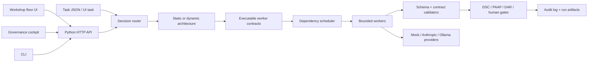

# Decision Agent

Bootstrap harness for building a dynamic, auditable, model-agnostic decision architecture system.

The backend/runtime is Python. The browser UI is still a lightweight frontend served from
`public/`.

The first version does not run autonomous agents directly. It creates executable worker contracts for bounded build agents:

```text
task -> decision type -> architecture -> worker contracts -> validation -> audit record
```

## Architecture



The fuller Mermaid architecture lives in
[docs/current-architecture.md](./docs/current-architecture.md), including the
component map, run lifecycle sequence, and runtime artifact shape. The thesis
rules and design constraints live in [ARCHITECTURE.md](./ARCHITECTURE.md).

Run the first demo:

```sh
npm run run:example
npm run ui
```

On Windows, after installing Python with pyenv-win, you can run the backend without npm:

```powershell
.\scripts\run-example.cmd
.\scripts\start-server.cmd
```

The app loads `.env` from the repository root automatically. For the local mock provider,
no variables are required. To use Anthropic, set:

```env
MODEL_PROVIDER=anthropic
ANTHROPIC_API_KEY=your_api_key_here
ANTHROPIC_MODEL=claude-sonnet-4-6
```

This writes a run folder under `data/runs/` with:

- the original task,
- the selected architecture,
- scoped worker contracts,
- an audit log,
- a run record.

The main cockpit is available at `http://localhost:4177`. The governance cockpit
is available from the link in the top-right of the main UI, or directly at
`http://localhost:4177/governance.html`.

## Commands

```sh
PYTHONPATH=backend/src python3 -m decision_agent.cli list
PYTHONPATH=backend/src python3 -m decision_agent.cli run examples/build-decision-agent.json
PYTHONPATH=backend/src python3 -m decision_agent.cli benchmark-config configs/benchmarks/procurement-layer-ablation.json
PYTHONPATH=backend/src python3 -m decision_agent.cli validate-contract data/runs/<run-id>/contracts/<worker>.json
npm test
```

Open the local GUI at `http://localhost:4177` after starting `npm run ui`.

Read [ARCHITECTURE.md](./ARCHITECTURE.md) and
[docs/current-architecture.md](./docs/current-architecture.md) before extending
the harness.
