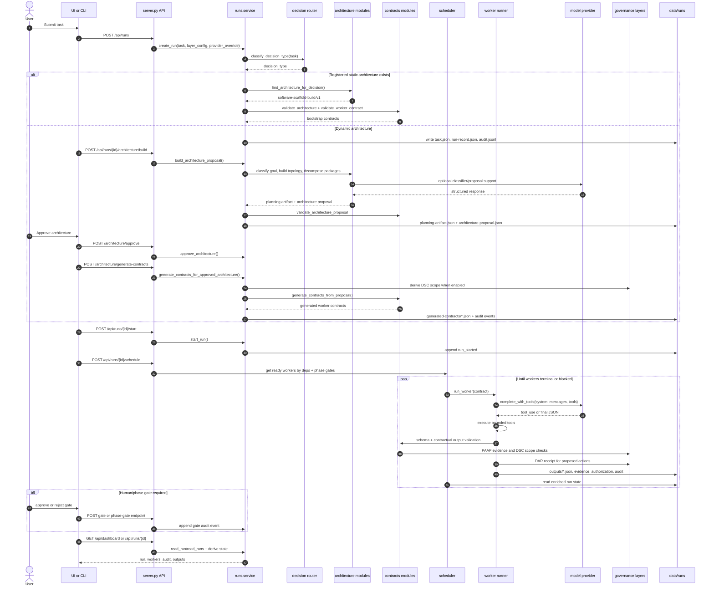
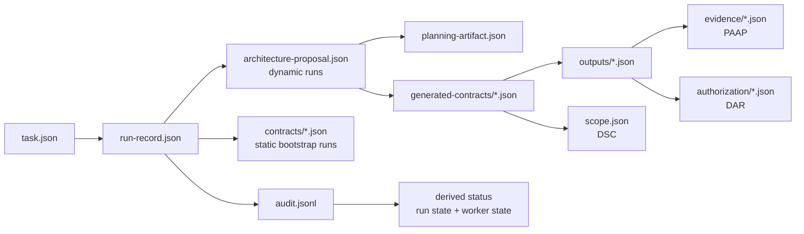

# Current Architecture Diagram

This diagram reflects the project as it is currently structured: a Python
decision-runtime backend, static browser cockpits, local run artifacts under
`data/`, and model providers hidden behind a provider registry.

## Component View

```mermaid
flowchart TB
  subgraph Clients["Clients and entry points"]
    CLI["CLI<br/>decision_agent.cli"]
    UI["Workshop floor UI<br/>public/index.html + app.js"]
    GovUI["Governance cockpit<br/>public/governance.html + governance.js"]
    Scripts["npm / scripts<br/>run example, UI, tests"]
  end

  subgraph Server["Local HTTP/static server"]
    Handler["DecisionAgentHandler<br/>decision_agent.server"]
    Static["Static file serving<br/>public/"]
    Api["JSON API routes<br/>/api/dashboard<br/>/api/runs/*<br/>/api/benchmarks/*"]
  end

  subgraph Runtime["Decision runtime modules"]
    RunService["Run service<br/>modules.runs.service"]
    State["Derived run state<br/>modules.runs.state"]
    Scheduler["Dependency scheduler<br/>modules.runs.scheduler"]
    Router["Decision router<br/>modules.decisions.router"]
    Suggestions["Task setup suggestions<br/>modules.decisions.suggestions"]
  end

  subgraph Architecture["Architecture planning"]
    Registry["Static architecture registry<br/>software-scaffold-build/v1"]
    Proposal["Dynamic proposal builder<br/>modules.architectures.proposal"]
    Goal["Goal structure classifier"]
    Topology["Topology builder"]
    Decomp["Domain/software decomposers"]
    Domains["Domain catalogs<br/>procurement, story"]
    Explorers["Explorer package catalog"]
  end

  subgraph Contracts["Contracts and validation"]
    ContractGen["Contract generator"]
    ContractValidator["Contract validator"]
    OutputValidator["Output validator"]
    WorkerContracts["Worker contracts<br/>read paths, write paths,<br/>tools, validators, schemas"]
  end

  subgraph Workers["Bounded worker execution"]
    WorkerRunner["Worker runner"]
    Tools["Worker tools<br/>read_file, write_file,<br/>list_files, run_tests,<br/>web_search stub"]
  end

  subgraph Governance["Governance layers"]
    LayerConfig["Layer config<br/>DSC, PAAP, DAR,<br/>human gate, validators"]
    DSC["DSC scope contracts"]
    PAAP["PAAP evidence scoring"]
    DAR["DAR action authorization"]
    Gates["Human and phase gates"]
  end

  subgraph Providers["Model providers"]
    ProviderRegistry["Provider registry"]
    Mock["Mock provider"]
    Anthropic["Anthropic provider"]
    Ollama["Ollama provider"]
  end

  subgraph Evaluation["Benchmark and thesis evaluation"]
    BenchRunner["Benchmark runner"]
    ConfigRunner["Benchmark config runner"]
    AutoApprover["Auto approver"]
    Metrics["Metrics and reports"]
    Fixtures["Fixtures<br/>procurement tasks"]
  end

  subgraph Storage["Local project storage"]
    RunsData["data/runs/&lt;run-id&gt;<br/>task, run-record,<br/>audit, contracts,<br/>outputs, scope,<br/>evidence, authorization"]
    BenchData["data/benchmarks/&lt;bench-id&gt;<br/>progress, results, summary"]
    Configs["configs/benchmarks/*.json"]
    Knowledge["knowledge/procurement/**"]
    Examples["examples/*.json"]
  end

  CLI --> RunService
  CLI --> ContractValidator
  CLI --> ConfigRunner
  Scripts --> CLI
  Scripts --> Handler

  UI --> Handler
  GovUI --> Handler
  Handler --> Static
  Handler --> Api
  Api --> RunService
  Api --> Suggestions
  Api --> Scheduler
  Api --> WorkerRunner
  Api --> BenchRunner

  RunService --> Router
  RunService --> Registry
  RunService --> ContractValidator
  RunService --> ContractGen
  RunService --> DSC
  RunService --> RunsData
  RunService --> State

  Suggestions --> Goal
  Suggestions --> Proposal
  Proposal --> Goal
  Proposal --> Topology
  Proposal --> Decomp
  Proposal --> Domains
  Proposal --> Explorers
  Proposal --> ProviderRegistry

  ContractGen --> WorkerContracts
  ContractGen --> ContractValidator
  WorkerContracts --> WorkerRunner

  Scheduler --> State
  Scheduler --> Gates
  Scheduler --> WorkerRunner
  WorkerRunner --> Tools
  WorkerRunner --> ProviderRegistry
  WorkerRunner --> OutputValidator
  WorkerRunner --> RunsData
  Tools --> RunsData
  Tools --> Knowledge
  Tools --> Examples

  OutputValidator --> PAAP
  OutputValidator --> DSC
  WorkerRunner --> DAR
  LayerConfig --> DSC
  LayerConfig --> PAAP
  LayerConfig --> DAR
  LayerConfig --> Gates

  ProviderRegistry --> Mock
  ProviderRegistry --> Anthropic
  ProviderRegistry --> Ollama

  BenchRunner --> RunService
  BenchRunner --> WorkerRunner
  BenchRunner --> AutoApprover
  BenchRunner --> Metrics
  BenchRunner --> Fixtures
  BenchRunner --> BenchData
  ConfigRunner --> Configs
  ConfigRunner --> BenchRunner
```

## Run Lifecycle

## Runtime Artifact Shape

